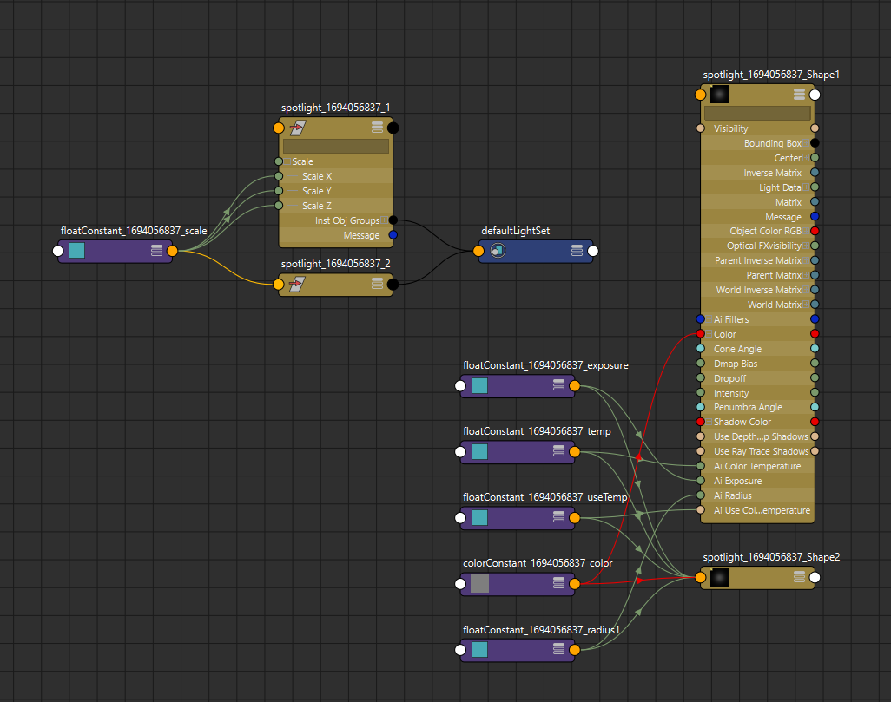

# Purpose
Create a pair of lights with shared attributes, such as when needed to have two lights for specular highlights in the eyes.

# Usage
Paste the contents of the .py file into Maya's Python scripting editor, and execute it using CTRL or CMD + Enter.

# Outcome
The lights share radius, exposure, color, colortemp, transform scale, and a float that will function as a boolean to toggle "Use Color Temperature".
The resulting nodes should look like this:
