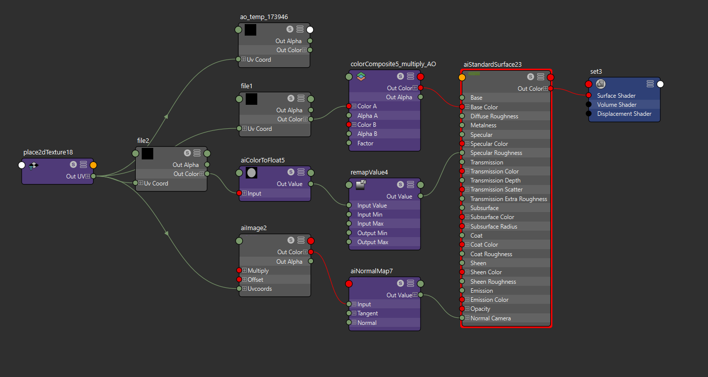

# Purpose
Create a basic texture shader setup faster.

Creates nodes for Base Color/Albedo, Ambient Occlusion, Roughness, and Normal, and connects them to an aiStandardSurfaceShader. The roughness map goes through a remapValue node in case you want to scale the values in it for more/less reflectivity. aiImage is used for the normal map solely because aiNormalMap is also used.

# Result

# Usage
Select a node graph window (such as within Hypershade,) copy the script into your MEL editor, and execute it.
